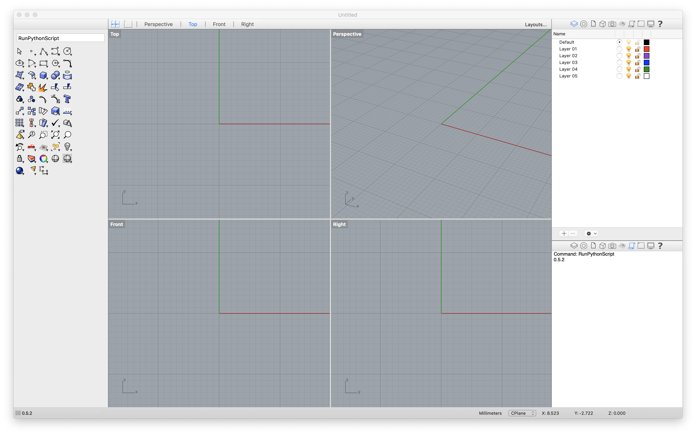

# [Historic_Masonry_Anagni_2019](http://www.block.arch.ethz.ch/brg/teaching/historic-masonry-summer-school-anagni-2019)
International Summer School on Historic Masonry - Anagni 2019


General website: [https://historicmasonryschool2019.wordpress.com/](https://historicmasonryschool2019.wordpress.com/)

## Schedule

**Tuesday 18/06/2019**

Time | Topic
---  | ---
12.30 - 13.30 | Overview Lecture `compas_masonry`
17.00 - 17.30 | Thrust Network Analysis (TNA) - theory
17.30 - 19.00 | Thrust Network Analysis (TNA) - tutorial

**Wednesday 19/06/2019**

Time | Topic
---  | ---
13.00 - 13.30 | Discrete Element Modeling (DEM) - theory
15.00 - 16.00 | Discrete Element Modeling (DEM) - tutorial
16.00 - 16.30 | Rigid Block Equilibrium (RBE) - theory
17.00 - 18.00 | Rigid Block Equilibrium (RBE) - tutorial     
18.00 - 19.00 | Piece-wise Rigid Displacements (PRD) - tutorial   
      
**Thursday  20/06/2019**

Time | Topic
---  | ---
16.45&nbsp;-&nbsp;18.00 | [Lecture](https://www.dropbox.com/s/6sq1ypvg06iaabq/20190110_Tongji_PBlock.pdf?dl=0) by Prof. Philippe Block at the American Academy in Rome, "Reimagining Shell Structures: Learning from the Master Builders".

 
## Preparations

**1. Install required tools**

*   [Anaconda 3](https://www.anaconda.com/distribution/)
*   [Rhino](https://www.rhino3d.com/download)
*   [VS Code](https://code.visualstudio.com/) or [Sublime Text 3](https://www.sublimetext.com/3) 
*   [3DEC demo version](https://www.itascacg.com/software-demo)

If you still have an old installation of Anaconda (for example version 2), please remove it.
Install Anaconda 3 in a sensible location, and don't register it on the PATH (Windows). 
The recommended location for installing Anaconda is in your home directory

* Mac: `~/anaconda3`
* Windows: `%USERPROFILE%\Anaconda3`

If you are using Rhino 5 on Windows, make sure to upgrade IronPython to `2.7.5`.
There are [detailed instructions in the COMPAS documentation](https://compas-dev.github.io/main/environments/rhino.html)
that explain how to do this.

**2. Install COMPAS**

To install COMPAS, simply type the following on the command line

> **Note**
>
> On Windows, use the Anaconda Prompt (launched as administrator), not the Command Prompt.
> <br />On Mac, use the Terminal.
>

```bash
conda config --add channels conda-forge
conda install COMPAS
```

On Mac, also run the following

```bash
conda install python.app
```

To check the installation, print the version of COMPAS in the interactive Python interpreter

```python
>>> import compas
>>> compas.__version__
'0.6.2'
>>> exit()
```

**3. Install COMPAS for Rhino**

If this is the first time you are using Rhino (Windows), or if you have never opened the
RhinoScriptEditor before, first open Rhino and then the RhinoScriptEditor,
by typing `EditPythonScript`. Then simply close Rhino again.
After that, on the command line, simply type

```bash
python -m compas_rhino.install
```

On Windows, you can specify the version of Rhino for which COMPAS should be installed.
The default on Windows is Rhino 6 and on Mac there is only Rhino 5.
To install COMPAS for Rhino 5 on Windows, do

```bash
python -m compas_rhino.install -v 5.0
```

To check the installation, launch Rhino and run the verification script that
can be found at the root of the workshop repo: `verify_rhino.py`
To run a script in Rhino, just type `RunPythonScript` at the Rhino command prompt
and select the verification scriopt from the repo.
The script should print out the version of COMPAS (`'0.6.2'`) in the console window.




**4. Install additional packages**

* shapely
* cvxopt
* cvxpy
* cplex

## First Steps


## Known Issues

