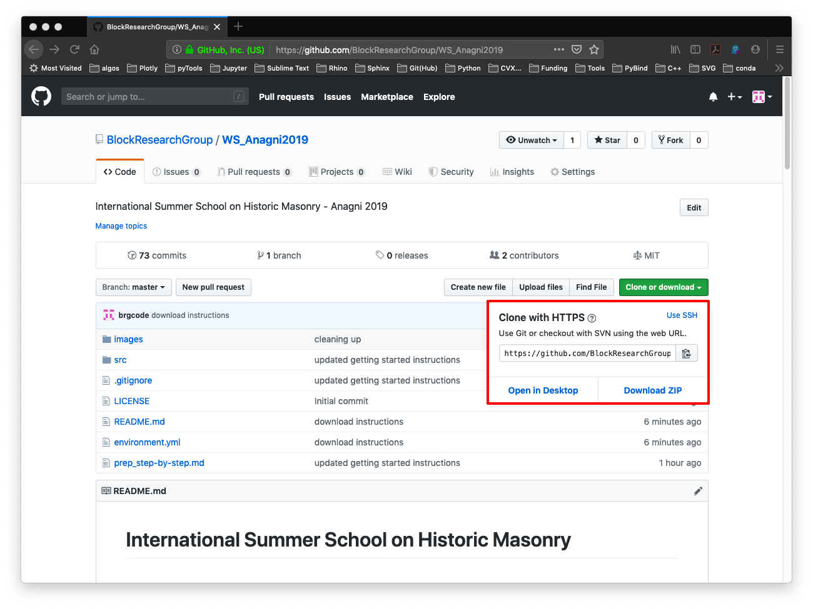
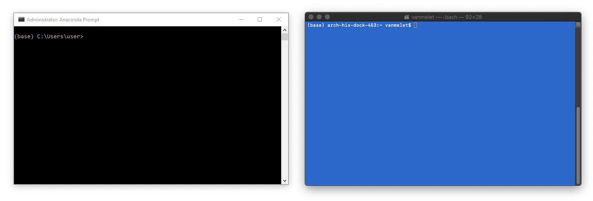
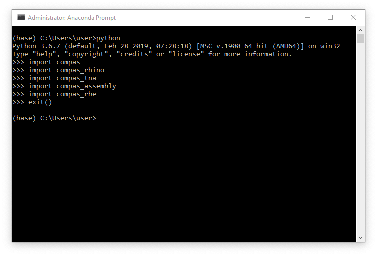
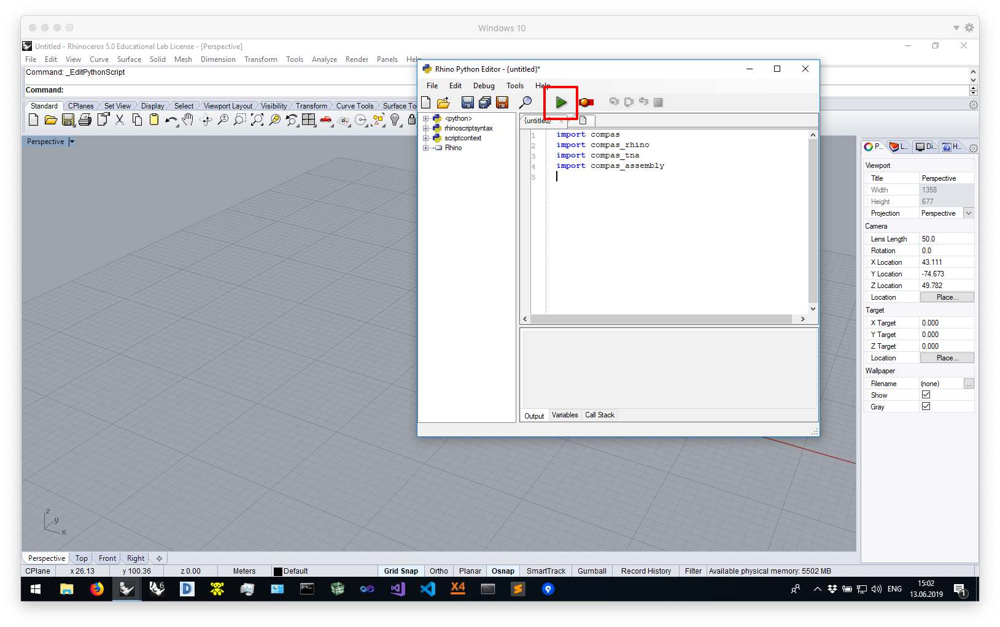
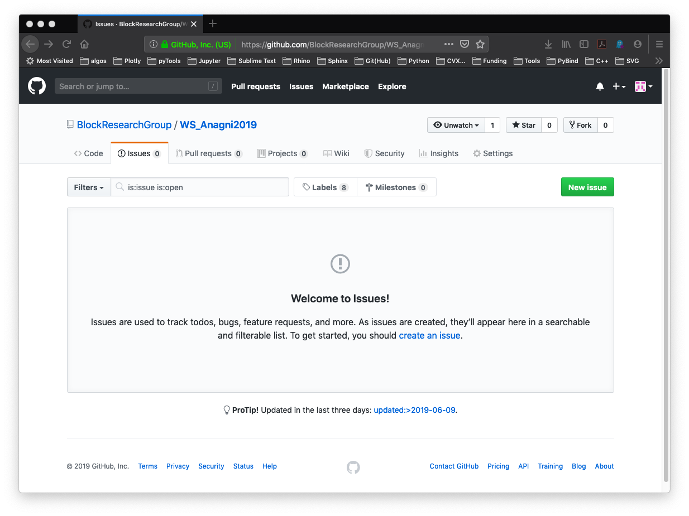

# Workshop COMPAS masonry

*Computational assessment of masonry structures*

* http://block.arch.ethz.ch/brg/teaching/historic-masonry-summer-school-anagni-2019
* https://historicmasonryschool2019.wordpress.com/
* https://github.com/compas-dev/compas
* https://github.com/BlockResearchGroup/compas_tna
* https://github.com/BlockResearchGroup/compas_assembly
* https://github.com/BlockResearchGroup/compas_rbe


## Schedule

**Tuesday 18/06/2019**

Time | Topic
---  | ---
12.30 - 13.30 | Overview Lecture `compas_masonry`
17.00 - 17.30 | Thrust Network Analysis (TNA) - theory
17.30 - 19.00 | Thrust Network Analysis (TNA) - tutorial

**Wednesday 19/06/2019**

Time | Topic
---  | ---
13.00 - 13.30 | Discrete Element Modeling (DEM) - theory
15.00 - 16.00 | Discrete Element Modeling (DEM) - tutorial
16.00 - 16.30 | Rigid Block Equilibrium (RBE) - theory
17.00 - 18.00 | Rigid Block Equilibrium (RBE) - tutorial     
18.00 - 19.00 | Piece-wise Rigid Displacements (PRD) - tutorial   
      
**Thursday  20/06/2019**

Time | Topic
---  | ---
16.45&nbsp;-&nbsp;18.00 | Lecture by Prof. Philippe Block at the American Academy in Rome, "Reimagining Shell Structures: Learning from the Master Builders".

 
## Preparations

**1. Clean up**

*   If you have an old version of Anaconda installed (for example Anaconda 2), please uninstall it.
*   If you have a version of Python registered on your `PATH`, please remove it (Windows only).

**2. Install required software**

*Note that this may take a while.*

*   [Anaconda 3](https://www.anaconda.com/distribution/)
*   [Rhino](https://www.rhino3d.com/download)
*   [Sublime Text 3](https://www.sublimetext.com/3)
*   [Git](https://git-scm.com/downloads) (Windows only)
*   [3DEC demo version](https://www.itascacg.com/software-demo) (Windows only)
*   [Microsoft Visual C++ Compiler for Python 2.7](https://www.microsoft.com/en-us/download/details.aspx?id=44266) (Windows only)

During the installation of the various tools, just accept all default settings.
The default location for installing Anaconda is usually in the home directory.
If it isn't, try to install it there anyway.
And make sure not to register it on the `PATH` (Windows only).
On Windows, the path to the home directory is stored in the variable `%USERPROFILE%`.
On Mac, it is accessible through `~`.
This results in the following recommended installation directories for Anaconda.

*On Windows*

```
%USERPROFILE%\Anaconda3
```

*On Mac*

```
~/anaconda3
```

**If you are using Rhino 5 on Windows, you have to upgrade the built-in IronPython to version `2.7.5`.
Not to the newest version, but to this specific version.**
There are [detailed instructions](https://compas-dev.github.io/main/environments/rhino.html)
in the COMPAS documentation that explain how to do this.

Instructions for configuring Sublime Text are also available in the COMPAS docs:
https://compas-dev.github.io/main/environments/sublimetext.html

**3. Download repository**

Finally, download the workshop repository to your computer and unzip it.
You should be on the [main repository page](https://github.com/BlockResearchGroup/WS_Anagni2019) now.
The download button is green and somewhere on the top right of the page.



Use a sensible location for the download so you can easily find it afterwards.
For example, create a folder called "Workshops" on your home drive and unzip the repository there.

*On Windows*

```
%USERPROFILE%\Workshops\WS_Anagni2019
```

*On Mac*

```
~/Workshops/WS_Anagni2019
```


## The command line

Many instructions in the next sections will have to be run from "the command line".

On Windows, use the "Anaconda Prompt" instead of the "Command Prompt", and make sure to run it *as administrator*.

> To find the Anaconda Prompt open the Start Menu and type "Anaconda".
> The Anaconda Prompt should already show up in the list of search results.
> To launch is as administrator, right click and select "Run as administrator".

On Mac, use the "Terminal".

**For simplicity, this guide will refer to both Terminal and Anaconda Prompt as "the command line".**




## Installation

We will use the command line to install the COMPAS Python packages (and their dependencies) required for the workshop.

First, navigate to the root folder of the workshop repository (the folder containing the file `environment.yml`).
Then, create an environment for the workshop called "anagni2019" and install the
required Python packages in it.

For example, if you used the download path from above, do

*On Windows*

```bash
cd %USERPROFILE%\Workshops\WS_Anagni2019
conda env create -f environment.yml
```

*On Mac*

```bash
cd ~/Workshops/WS_Anagni2019
conda env create -f environment.yml
```

**Don't forget to activate the environment!**

```bash
conda activate anagni2019
```

> The name of the active environment appears at the beginning of the current command line.
> For example, if the "base" environment is active, you will see something like
> `(base) C:\Users\user>`. When the workshop environment is active, you should see
> something like `(anagni2019) C:\Users\user>`.


Finally, verify the installation using an interactive Python session.
Start the session by typing `python` on the command line. 
Then try to import the packages that were just installed.

```python
>>> import compas
>>> import compas_tna
>>> import compas_assembly
>>> import compas_rbe
>>> exit()
```




## Rhino configuration

If this is the first time you are using Rhino 6 for Windows, or if you have never opened its
PythonScriptEditor before, do so now: open Rhino and open the editor by typing `EditPythonScript`.
Then simply close Rhino again.

To install the COMPAS packages, type the following on the command line.

**Make sure the workshop environment ("anagni2019") is active!**

```bash
python -m compas_rhino.install -p compas compas_rhino compas_tna compas_assembly
```

On Windows, COMPAS packages are installed for Rhino 6 by default.
To install COMPAS for Rhino 5 instead, do

```bash
python -m compas_rhino.install -v 5.0 -p compas compas_rhino compas_tna compas_assembly
```

To check the installation, launch Rhino, open the PythonScriptEditor, and try
importing the COMPAS packages in a script.
Then run the script and if no errors pop up, you are good to go.

```python
import compas
import compas_rhino
import compas_tna
import compas_assembly
```




## Get help

**Many problems during installation are related to misspelled paths or command line instructions.**

If you run into problems with the above instructions, the preferred way to ask
for help is through the issue tracker of the current repository at https://github.com/BlockResearchGroup/WS_Anagni2019/issues
such that others can benefit from the discussion.

Otherwise you can also contact us via email at dellendice@arch.ethz.ch.




## Troubleshooting

If you had installed all packages in the base environment and you would like to install
them in a dedicated workshop environment instead (recommended), while resetting the
base to its original state, do the following.

**On Windows, make sure to run the command line (Anaconda Prompt) as administrator.**

```bash
conda install --revision 1
```

This might take a while (10 min).
Just follow the instructions, and update `conda` to the latest version once the
roll back has completed.

```bash
conda update conda
```

You will also have to remove `compas_tna`, `compas_rbe`, and `compas_assembly`
separately.

```bash
pip uninstall compas_tna
pip uninstall compas_rbe
pip uninstall compas_assembly
```

After all this, you can use the environment file to create a dedicated environment
for the workshop and install all necessary packages.

```bash
conda env create -f environment.yml
conda activate anagni2019
```

Check the installation with an interactive Python interpreter.

```python
import compas
import compas_tna
import compas_assembly
import compas_rbe
```

Finally, update the Rhino installation.

**Make sure that the "anagni2019" environment is active!**

```bash
python -m compas_rhino.uninstall
python -m compas_rhino.install -p compas compas_rhino compas_tna compas_assembly
```

Or, for Rhino 5 on Windows

```bash
python -m compas_rhino.uninstall -v 5.0
python -m compas_rhino.install -v 5.0 -p compas compas_rhino compas_tna compas_assembly
```
