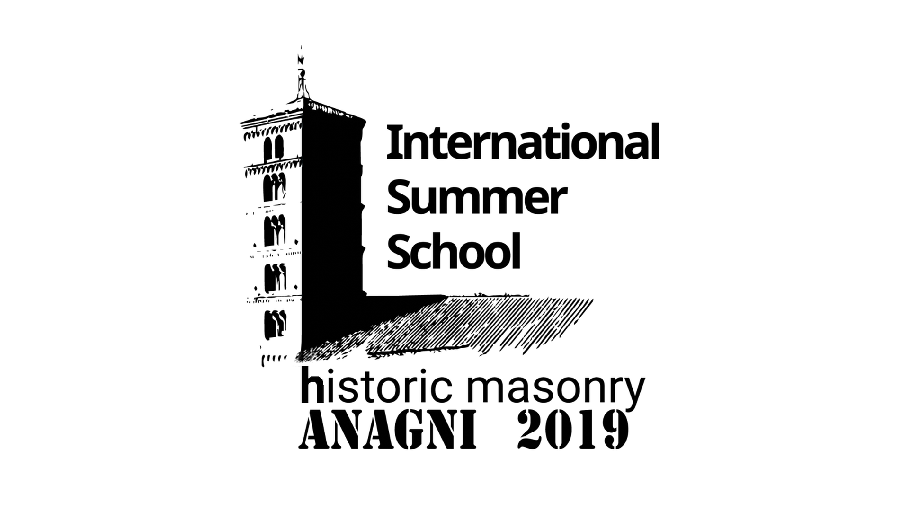

# [Historic_Masonry_Anagni_2019](http://www.block.arch.ethz.ch/brg/teaching/historic-masonry-summer-school-anagni-2019)
International Summer School on Historic Masonry - Anagni 2019

General website: [https://historicmasonryschool2019.wordpress.com/](https://historicmasonryschool2019.wordpress.com/)

## Lecture by Prof. Philippe Block

* **[Lecture](https://www.dropbox.com/s/6sq1ypvg06iaabq/20190110_Tongji_PBlock.pdf?dl=0)** at the American Academy in Rome.

## Theory
* Thrust Network Analysis (TNA)
* Discrete Element Method (DEM)
* Piecewise Rigid Discrete (PRD)

## Tools
* Installation
  * Softwares
* Test files
* Examples
* Geometry Data
